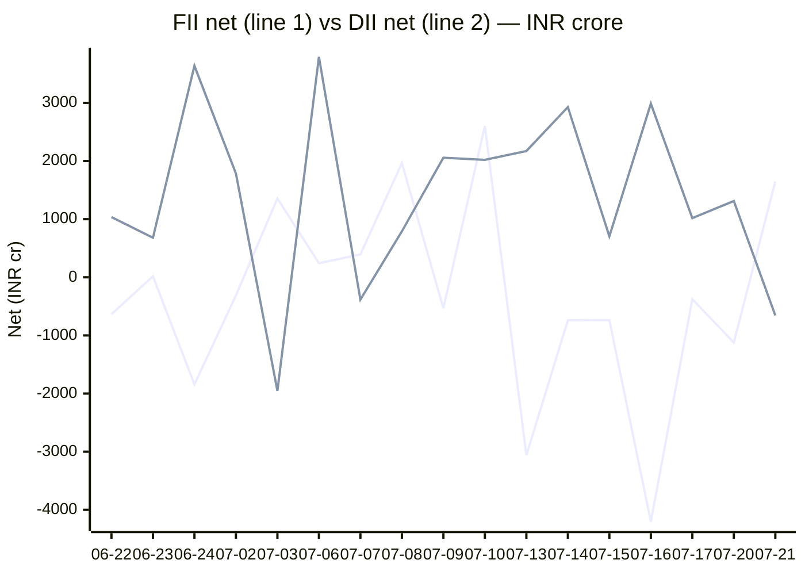

# FII/DII Activity API

Daily **FII** (Foreign Institutional Investors) and **DII** (Domestic Institutional Investors) net buy/sell activity for Indian equity markets — scraped by GitHub Actions, served as static JSON via GitHub Pages and `raw.githubusercontent.com`. Zero servers, zero ongoing cost.

## Chart

<!-- CHART:BEGIN -->
**FII vs DII net equity flow (₹ crore, most recent sessions)**



<sub>FII = first line, DII = second line. Auto-generated from `data/` by `scripts/chart.mjs` on each scrape. Last 17 session(s).</sub>
<!-- CHART:END -->

## Endpoints (static JSON)

The **canonical** base URL is GitHub Pages — it never expires and has no external DNS dependency. The custom domain and raw URLs are equivalent mirrors of the same data.

| URL | Description |
| --- | --- |
| `https://chirag127.github.io/fii-dii-activity-api/data/latest.json` | **Canonical** — most recent scrape |
| `https://chirag127.github.io/fii-dii-activity-api/data/<YYYY-MM-DD>.json` | Canonical — a specific day |
| `https://raw.githubusercontent.com/chirag127/fii-dii-activity-api/main/data/latest.json` | Mirror via raw (no Pages dependency) |
| `https://raw.githubusercontent.com/chirag127/fii-dii-activity-api/main/data/<YYYY-MM-DD>.json` | Mirror via raw — a specific day |
| `https://cdn.jsdelivr.net/gh/chirag127/fii-dii-activity-api@main/data/latest.json` | Mirror via jsDelivr CDN (cached, fast) |
| `https://cdn.statically.io/gh/chirag127/fii-dii-activity-api/main/data/latest.json` | Mirror via Statically CDN |
| `https://fii-dii.api.oriz.in/data/latest.json` | Mirror via custom domain (may change) |

Machine-readable contract: [`openapi.yaml`](./openapi.yaml) (import into RapidAPI, Postman, Swagger UI, etc.).

## Response shape (`latest.json`)

```json
{
  "date": "2026-06-22",
  "source": "nse",
  "equity":     { "fii_buy": 0, "fii_sell": 0, "fii_net": 0, "dii_buy": 0, "dii_sell": 0, "dii_net": 0 },
  "derivative": { "fii_buy": 0, "fii_sell": 0, "fii_net": 0, "dii_buy": 0, "dii_sell": 0, "dii_net": 0 }
}
```

`source` is one of `nse` (primary), `moneycontrol` (fallback), or `placeholder` (both failed). All values are INR crores.

## Schedule

Weekdays 13:00 UTC (~18:30 IST, after NSE close). Manually re-runnable via the **scrape** workflow.

## Local run

```bash
npm install
node scripts/scrape.mjs   # writes data/<today>.json + data/latest.json
```

## License

MIT — see [LICENSE](./LICENSE).
