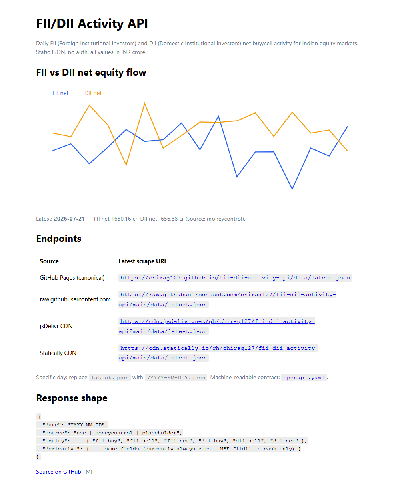
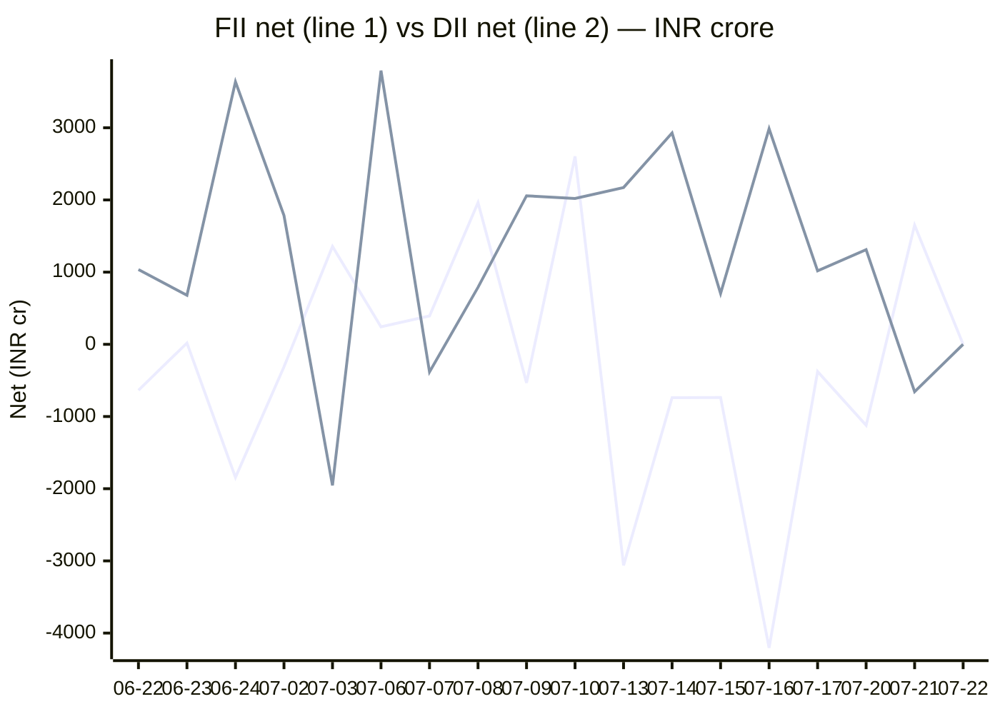

# FII/DII Activity API

Daily **FII** (Foreign Institutional Investors) and **DII** (Domestic Institutional Investors) net buy/sell activity for Indian equity markets — scraped by GitHub Actions, served as static JSON via GitHub Pages and `raw.githubusercontent.com`. Zero servers, zero ongoing cost.



<sub>Live site screenshot, auto-captured from the deployed page by `scripts/screenshot.mjs`.</sub>

## Contents

- [Chart](#chart) · [Endpoints](#endpoints-static-json) · [Response shape](#response-shape-latestjson)
- [How it works](#how-it-works) · [Project layout](#project-layout) · [Scripts](#scripts)
- [Data pipeline](#data-pipeline) · [Testing](#testing) · [Deploy](#deploy)
- [Local development](#local-development) · [Schedule](#schedule) · [License](#license)

## Chart

<!-- CHART:BEGIN -->
**FII vs DII net equity flow (₹ crore, most recent sessions)**



<sub>FII = first line, DII = second line. Auto-generated from `data/` by `scripts/chart.mjs` on each scrape. Last 18 session(s).</sub>
<!-- CHART:END -->

## Endpoints (static JSON)

The **canonical** base URL is GitHub Pages — it never expires and has no external DNS dependency. The raw and CDN URLs are equivalent mirrors of the same committed data.

| URL | Description |
| --- | --- |
| `https://chirag127.github.io/fii-dii-activity-api/data/latest.json` | **Canonical** — most recent scrape |
| `https://chirag127.github.io/fii-dii-activity-api/data/<YYYY-MM-DD>.json` | Canonical — a specific day |
| `https://raw.githubusercontent.com/chirag127/fii-dii-activity-api/main/data/latest.json` | Mirror via raw (no Pages dependency) |
| `https://raw.githubusercontent.com/chirag127/fii-dii-activity-api/main/data/<YYYY-MM-DD>.json` | Mirror via raw — a specific day |
| `https://cdn.jsdelivr.net/gh/chirag127/fii-dii-activity-api@main/data/latest.json` | Mirror via jsDelivr CDN (cached, fast) |
| `https://cdn.statically.io/gh/chirag127/fii-dii-activity-api/main/data/latest.json` | Mirror via Statically CDN |

Machine-readable contract: [`openapi.yaml`](./openapi.yaml) (import into RapidAPI, Postman, Swagger UI, etc.).

## Response shape (`latest.json`)

```json
{
  "date": "2026-06-22",
  "source": "nse",
  "equity":     { "fii_buy": 0, "fii_sell": 0, "fii_net": 0, "dii_buy": 0, "dii_sell": 0, "dii_net": 0 },
  "derivative": { "fii_buy": 0, "fii_sell": 0, "fii_net": 0, "dii_buy": 0, "dii_sell": 0, "dii_net": 0 }
}
```

`source` is one of `nse` (primary), `moneycontrol` (fallback), or `placeholder` (both failed). All values are INR crores. `equity` is the Capital Market (cash) segment; `derivative` is reserved for F&O and is currently always zero because the NSE `fiidii` endpoint reports cash only.

## How it works

```
                    ┌─────────────────────────────────────────────┐
  GitHub Actions    │  scrape.yml (cron, weekdays 13:00 UTC)       │
  (no servers)      │     └─> node scripts/scrape.mjs              │
                    │            NSE  ──try──> parseNse            │
                    │             │ fail                           │
                    │            Moneycontrol ──try──> parseMC     │
                    │             │ fail                           │
                    │            placeholder (all-zero)            │
                    │            └─> writes data/<date>.json       │
                    │                       data/latest.json       │
                    │     └─> node scripts/chart.mjs (README chart)│
                    │     └─> git commit + push                    │
                    └───────────────────┬─────────────────────────┘
                                        │ push to main
                    ┌───────────────────▼─────────────────────────┐
                    │  deploy.yml → scripts/build-site.mjs → dist/ │
                    │     → GitHub Pages (canonical)               │
                    └─────────────────────────────────────────────┘
  Mirrors (same committed data): raw.githubusercontent · jsDelivr · Statically
```

A scrape is accepted **only if it validates and carries complete FII _and_ DII equity data** — a partial or all-zero parse is rejected and falls through to the next source, so a bad upstream can never overwrite good data with zeros.

## Project layout

| Path | Purpose |
| --- | --- |
| `scripts/scrape.mjs` | Entry point — fetches NSE → Moneycontrol → placeholder, validates, writes `data/`. |
| `scripts/lib/schema.mjs` | Pure, tested core: `parseNse`, `parseMoneycontrolRow`, `toNumber`, `buildPayload`, `validatePayload`, `hasCompleteEquity`. |
| `scripts/chart.mjs` | Regenerates the Mermaid chart between the `<!-- CHART -->` markers in this README. |
| `scripts/build-site.mjs` | Builds the dependency-free static site (`dist/`) for GitHub Pages: `index.html` + inline SVG chart + `data/` + `openapi.yaml`. |
| `scripts/screenshot.mjs` | Captures `docs/screenshot.png` from the live (or local) site via Playwright. |
| `scripts/backfill.mjs` | One-off historical backfill of `data/` (cross-verified provisional figures). |
| `scripts/*.test.mjs` | Test suite (see [Testing](#testing)). |
| `data/*.json` | The API payloads — one file per trading day plus `latest.json`. |
| `openapi.yaml` | OpenAPI 3.1 contract (import into RapidAPI/Postman/Swagger). |
| `.github/workflows/` | `scrape.yml` (cron), `ci.yml` (tests), `deploy.yml` (Pages), `megalinter.yml`. |

## Scripts

```bash
npm run scrape        # fetch today's data → data/<today>.json + data/latest.json
npm run chart         # regenerate the README chart from data/
npm test              # full offline test suite (deterministic)
npm run test:live     # live-endpoint integration tests (hits the deployed URLs)
node scripts/build-site.mjs   # build dist/ (what Pages serves)
node scripts/screenshot.mjs   # refresh docs/screenshot.png from the live site
```

**Dependencies:** runtime `cheerio` (HTML parsing) only; tests use the built-in `node:test` runner — zero dev dependencies.

## Data pipeline

1. **Fetch** — `scrape.mjs` calls NSE's `fiidii` JSON API first. On any failure (NSE blocks non-browser IPs) it falls back to scraping the Moneycontrol activity table.
2. **Parse** — `parseNse` matches the `FII/FPI *` and `DII **` category rows; `parseMoneycontrolRow` reads the cash table, skipping the leading date column. `toNumber` normalizes `1,234.50`, `₹`, and accounting `(913.59)` → `-913.59`.
3. **Validate** — `validatePayload` checks all six fields are finite and that `buy − sell ≈ net` (±1 cr rounding). `hasCompleteEquity` requires both FII and DII sides populated.
4. **Write** — the accepted payload is written to `data/<date>.json` and `data/latest.json`.
5. **Publish** — `chart.mjs` refreshes the README chart; the commit is pushed; `deploy.yml` rebuilds the static site to Pages.

## Testing

Run `npm test`. The suite (built-in `node:test`, no framework) covers:

| File | What it checks |
| --- | --- |
| `scripts/lib/schema.test.mjs` | `toNumber` edge cases, `parseNse`/`parseMoneycontrolRow`, validation, `hasCompleteEquity`. |
| `scripts/data.test.mjs` | Every committed `data/*.json` is schema-valid; reports non-zero coverage. |
| `scripts/chart.test.mjs` | The README chart block is present and line-ending agnostic. |
| `scripts/openapi.test.mjs` | `openapi.yaml` is 3.1, documents both endpoints, lists all servers, example is schema-valid. |
| `scripts/no-oriz.test.mjs` | Brand guard — the project is strictly "FII/DII Activity API". |
| `scripts/live.test.mjs` | (`LIVE=1`) every published mirror returns 200 + valid JSON; upstreams reachable. |

CI (`ci.yml`) runs the offline suite, asserts the chart is not stale, and confirms the static site builds — on every push and PR.

## Deploy

GitHub Pages, built by `deploy.yml` on every push that touches `data/`, `README.md`, `openapi.yaml`, or the build script. There is **no external template and no custom domain** — `scripts/build-site.mjs` emits a self-contained `dist/` (landing page with an inline SVG chart, all data files, the OpenAPI spec). Pages serves it at the canonical `github.io` URL; jsDelivr/Statically/raw mirror the same committed files.

## Local development

```bash
npm install
node scripts/scrape.mjs          # try a real scrape (NSE may 404 from non-browser IPs — expected)
npm test                         # verify everything offline
node scripts/build-site.mjs      # build the site locally into dist/
npx serve dist                   # preview at http://localhost:3000
SITE=http://localhost:3000 node scripts/screenshot.mjs   # screenshot the local build
```

## Schedule

Weekdays 13:00 UTC (~18:30 IST, after NSE close). Manually re-runnable via the **scrape** workflow (`workflow_dispatch`).

## License

MIT — see [LICENSE](./LICENSE).
